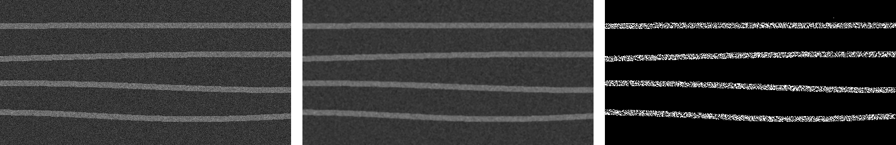

# End-to-End OCT Denoising & Segmentation Pipeline

This repository details the complete workflow I developed at **Boston University's Tian Lab** for processing noisy Optical Coherence Tomography (OCT) B-scans.

The solution is a two-stage pipeline:
1.  **Denoising:** A self-supervised **Noise2Void (N2V)** model cleans the raw, noisy OCT scans.
2.  **Segmentation:** A **U-Net** model segments the key structures from the newly cleaned image.

I was responsible for the entire pipeline, from data curation to final model evaluation.

<p align="center">
  <br/>
  <em><b>Pipeline Visualized:</b> (Left) Raw noisy OCT-like scan → (Middle) Self-supervised denoising (N2V) → (Right) Final segmentation (U-Net)</em>
</p>

---

## My End-to-End Workflow

This project demonstrates end-to-end ownership of an applied AI problem.

* **1. Data Curation (Ground Truth):** My first step was building the ground-truth dataset. I used **ImageJ** and **AnnotatorJ** to manually annotate and prepare the training data, which is a critical and often overlooked step in medical imaging.
* **2. Self-Supervised Denoising (Noise2Void):** To handle the speckle noise, I trained and tuned a Noise2Void model. This self-supervised approach is powerful because it can be trained *without* requiring perfectly clean "ground truth" images, which are often impossible to acquire.
* **3. Segmentation (U-Net):** With a clean, denoised image, I then trained a U-Net baseline to perform the final segmentation, isolating the key retinal layers for analysis.
* **4. Rigor & Reproducibility:** I packaged the code into clean scripts and notebooks, ensuring my collaborators could verify results quickly and then swap in their own proprietary data.

---

## How to Run This Project

### Option 1: Launch in Colab (Easiest)

The quickest way to see the models in action is to use the Colab notebooks, which are ready to run with a GPU.

| Notebook | What it shows | Launch |
|---|---|---|
| **Denoising Demo** | Self-supervised denoising with Noise2Void | [](https://colab.research.google.com/github/ajung23/oct-denoise-unet/blob/main/notebooks/01_n2v_demo.ipynb) |
| **Segmentation Demo** | Training a U-Net on the denoised images | [](https://colab.research.google.com/github/ajung23/oct-denoise-unet/blob/main/notebooks/02_unet_training.ipynb) |

### Option 2: Local Quickstart

You can also run the entire pipeline locally using the `Makefile` and CLI scripts.

```bash
# 1. Create environment
python -m venv .venv && source .venv/bin/activate
pip install -r requirements.txt  # Install all dependencies

# 2. Make synthetic data to test the pipeline
python scripts/make_synthetic_oct.py --out data/synth --n 20
# or use the Makefile shortcut:
# make synth

# 3. Train the U-Net model
python scripts/train_unet.py --data data/synth --out runs/unet_demo --epochs 2
# or use the Makefile shortcut:
# make unet

# 4. Run evaluation
python scripts/eval_metrics.py --pred runs/unet_demo/preds --gt data/synth/masks
# or use the Makefile shortcut:
# make eval
```

---

### Repo Structure

```
oct-denoise-unet/
├─ notebooks/
│ ├─ 01_n2v_demo.ipynb       # Colab demo for Denoising
│ └─ 02_unet_training.ipynb  # Colab demo for Segmentation
├─ scripts/
│ ├─ make_synthetic_oct.py   # Data generation
│ ├─ train_unet.py           # Main training script
│ └─ eval_metrics.py         # Evaluation script
├─ examples/                 # Result images (like the one above)
├─ requirements.txt
├─ Makefile                  # Make commands for quick setup
└─ README.md
```
