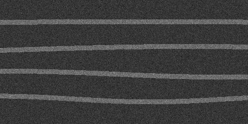
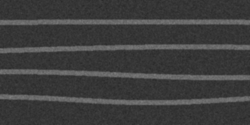
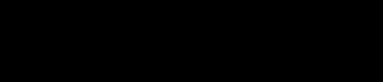

# OCT Denoising + Segmentation (Noise2Void + U‑Net)

> Self‑supervised denoising and layer/region segmentation for OCT B‑scans. Built from work done at **BU Tian Lab (Computational Imaging Systems Lab)**. This repo is structured to be easy for labs to evaluate and for recruiters to scan.

## TL;DR
- **Denoising:** `Noise2Void` (self‑supervised; no clean ground truth needed)
- **Segmentation:** `U‑Net` (optionally with Dense blocks)
- **Reproducibility:** simple scripts + notebooks + fixed env
- **Data privacy:** no PHI; synthetic examples included

---

## Repo Layout
```
oct-denoise-unet/
├── examples/                  # Example input/output visuals (safe, synthetic)
│   ├── input_oct.png          # Raw noisy OCT-like B-scan (synthetic)
│   ├── denoised_oct.png       # Noise2Void result (synthetic)
│   └── segmentation_mask.png  # U‑Net mask example (synthetic)
├── scripts/
│   ├── denoise_n2v.py         # Train/predict with Noise2Void
│   ├── train_unet.py          # Train U‑Net on OCT masks
│   ├── eval_metrics.py        # PSNR/SSIM utilities
│   └── make_synthetic_oct.py  # Generate synthetic OCT-like data
├── notebooks/
│   ├── 01_n2v_demo.ipynb      # Minimal N2V demo
│   └── 02_unet_training.ipynb # Minimal U‑Net training template
├── requirements.txt
└── README.md
```


---

## Quickstart

```bash
# 1) Create env
python -m venv .venv && source .venv/bin/activate  # Windows: .venv\Scripts\activate
pip install --upgrade pip
pip install -r requirements.txt

# 2) See the pipeline on synthetic data
python scripts/make_synthetic_oct.py --out data/synth --n 20
python scripts/denoise_n2v.py --data data/synth --out runs/n2v_demo
python scripts/train_unet.py --data data/synth --out runs/unet_demo --epochs 3

# 3) Evaluate
python scripts/eval_metrics.py --pred runs/unet_demo/preds --gt data/synth/masks
```

**Real data:** Place your B‑scans under `data/` following:
```
data/
├── raw/           # noisy OCT .png/.tif
├── denoised/      # N2V outputs
└── masks/         # ImageJ/AnnotatorJ .png masks (same basename as raw)
```

---

## Methods (Short)

| Component | Library | Why |
|---|---|---|
| Noise2Void | `n2v` / `csbdeep` (Keras) | Self‑supervised denoising; no clean ground truth required. |
| U‑Net (+Dense blocks optional) | PyTorch | Strong baseline for OCT layer/region segmentation. |

**Metrics:** PSNR, SSIM (image quality); Dice/IoU (segmentation).

---

## Results (synthetic preview)

<p align="center">
  
  
  
</p>

Left: noisy input. Middle: N2V denoised. Right: sample mask. (Synthetic images—safe to publish.)

---

## Lab‑grade Reproducibility
- Fixed seeds where practical; scripts save configs and logs to `runs/`.
- Clear separation: **preprocess → denoise → segment → evaluate**.
- Works with ImageJ/AnnotatorJ masks (binary/label PNGs).

---

## Background & Notes (from my BU Tian Lab work)
- Built **ground‑truth datasets** by annotating OCT lung images with **ImageJ/AnnotatorJ**.
- Tuned **Noise2Void** to reduce speckle noise and improve downstream segmentation.
- Trained a **U‑Net with Dense‑block variants**; iterated hyperparameters for better prediction.
- (Appendix idea) For **voltage imaging**: ultra‑high FPS, low SNR, no clean ground truth → combine **Deep Image Prior (DIP)** with **Noise2Void** for self‑supervised denoising.

---

## Ethics & Data
- No PHI is stored here.
- Synthetic samples are provided so the pipeline runs anywhere.
- For real data, ensure IRB/PI approval and proper de‑identification.

---

## How to Read This Repo (for reviewers)
- **5 minutes:** open `notebooks/01_n2v_demo.ipynb` and run cells.
- **15 minutes:** run the `scripts/` quickstart on CPU (synthetic data).
- **30–60 minutes:** point to your own OCT folder + masks and train a U‑Net.

---

## Contact
**Euijin Jung** · ajung23@bu.edu · (872) 381‑3969 · Chicago, IL  
Open to **volunteer RA** roles in **AI/medical imaging**; available to start ASAP.
