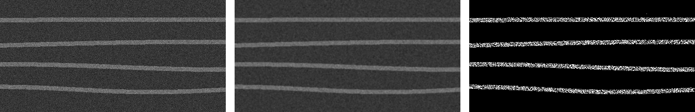
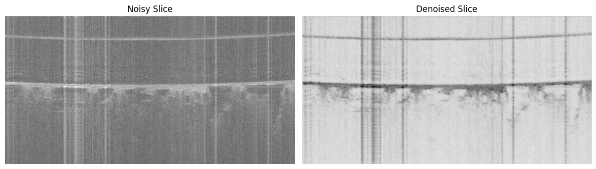
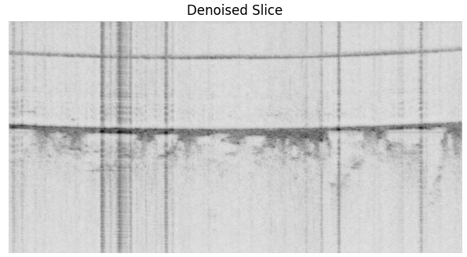
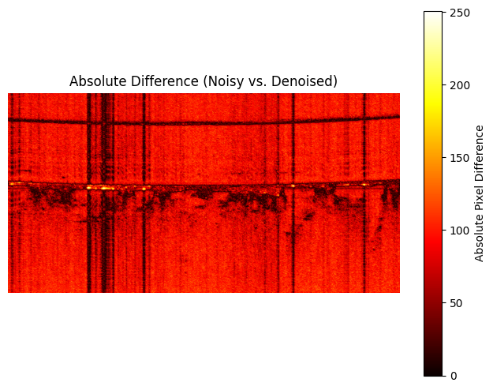

# End-to-End OCT Denoising & Segmentation Pipeline

This repository documents the workflow I built at **Boston University’s Tian Lab** for processing noisy Optical Coherence Tomography (OCT) B-scans.  
It integrates **self-supervised denoising** and **deep-learning segmentation** into one reproducible, researcher-friendly pipeline.

<p align="center">
  
  <br/>
  <em><b>Pipeline overview:</b> (Left) Noisy OCT B-scan → (Middle) Noise2Void self-supervised denoising → (Right) U-Net segmentation.</em>
</p>

---

## What This Project Demonstrates

This work represents full ownership of an applied AI problem in medical imaging—from data collection to model interpretation.

### 1. Data Curation & Annotation
I created the ground-truth masks using **ImageJ + AnnotatorJ**, handling preprocessing, slice selection, and layer boundary marking.  
This step ensured the downstream supervised tasks had consistent and reliable dataset structure.

### 2. Self-Supervised Denoising (Noise2Void)
To address strong speckle noise and sensor artifacts, I trained and tuned a **Noise2Void (N2V)** model.  
N2V is particularly valuable in medical imaging because it learns directly from raw noisy scans—no clean reference images required.

### 3. Segmentation (U-Net)
After denoising, I implemented a compact **U-Net** baseline (see `train_unet.py`).  
The model segments relevant structures from the denoised B-scans, improving clarity and enabling more stable downstream analysis.

### 4. Reproducibility & Handoff
The repository includes:
- GPU-ready Colab notebooks  
- A clean folder structure  
- A Makefile for quick local execution  
- Static before/after images for reviewers  

This design allows researchers or collaborators to validate results quickly and substitute their own OCT datasets with minimal friction.

---

## Noise2Void Denoising Results

Below is a representative slice from the noisy OCT stack.  
These images allow readers to inspect improvements **without running the model**.

### Noisy vs. Denoised (Side-by-Side)



### Denoised Slice (Alone)



### Absolute Pixel Difference (Noise Removed)



---

## How to Run the Pipeline

### Option 1 — Launch in Colab (Recommended)

These notebooks run on free GPUs and contain all required code:

| Notebook | Description | Launch |
|---------|-------------|--------|
| **Noise2Void Demo** | Train & apply self-supervised N2V denoising | [](https://colab.research.google.com/github/ajung23/oct-denoise-unet/blob/main/notebooks/01_n2v_demo.ipynb) |
| **U-Net Segmentation Demo** | Train U-Net on denoised B-scans | [](https://colab.research.google.com/github/ajung23/oct-denoise-unet/blob/main/notebooks/02_unet_training.ipynb) |

---

### Option 2 — Local Quickstart

```bash
# 1. Environment setup
python -m venv .venv && source .venv/bin/activate
pip install -r requirements.txt

# 2. Supply your dataset
# NOTE: Training data is NOT included; add your own noisy/clean
# (or noisy-only for N2V) OCT images.

# 3. Train U-Net
python train_unet.py \
    --data /path/to/data \
    --out runs/unet_demo \
    --epochs 10

# Or using Makefile:
make unet
