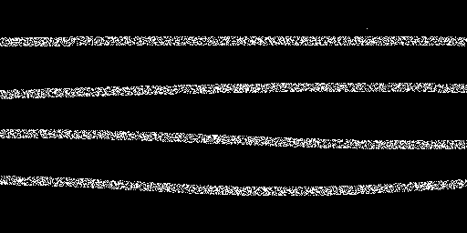

# OCT Denoising + Segmentation (Noise2Void + U-Net)

Self-supervised **Noise2Void** denoising and **U-Net** segmentation for OCT images.

---

## 📦 Structure
```
examples/               # demo .npy/.tif files  
ImageDenoising/         # Noise2Void scripts  
ImageSegmentation/      # U-Net scripts  
```

---

## Quick Guide 
```bash
python -m venv .venv
source .venv/bin/activate      # Windows: .venv\Scripts\activate
pip install -r requirements.txt

# Noise2Void
cd ImageDenoising
python n2v_simple_main.py

# U-Net
cd ../ImageSegmentation
python preprocessing.py
python train.py
```

---

## 📊 Example Results

| Input (Raw OCT) | Denoised (Noise2Void) | Segmented (U-Net) |
|:--:|:--:|:--:|
|  |  |  |


## 📁 Full Dataset Access
Due to size and data policy, the complete OCT dataset used for training is not included.
Small demo files are provided in `examples/` for reproducibility.
The full dataset can be shared upon request or accessed through the BU Tian Lab OCT collection.

---

## 🧠 Methods
- **Noise2Void** — blind-spot, self-supervised denoising.
- **U-Net** — encoder–decoder segmentation.

Author: **Euijin Jung (EJ)**  
License: **MIT**
